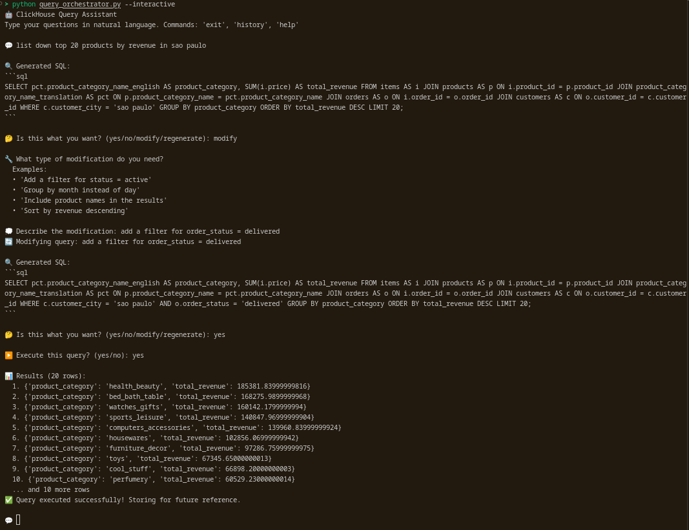
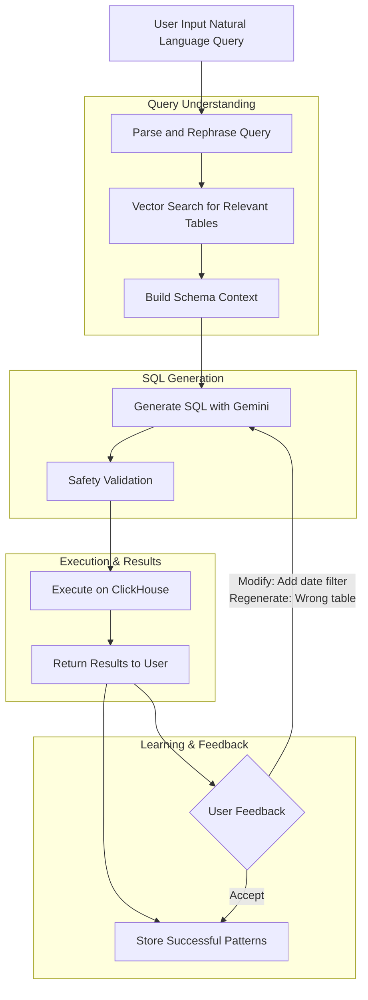

# ClickHouse Text-to-SQL System

**Tired of non-technical users constantly asking you to write SQL queries for their data requests? Spending hours translating "show me sales trends" into complex database queries across hundreds of tables?**

This Natural Language to SQL translation system solves that problem by letting anyone ask questions in plain English and get accurate SQL queries for ClickHouse data warehouses containing 100-500 tables.

## Core Features

- **🤖 Human-in-the-Loop AI System** - Interactive refinement with real-time feedback and multi-turn conversations
- **🧠 RAG-Powered Semantic Search** - Vector embeddings for intelligent table discovery across 100-500 tables
- **📊 AI Metadata Enrichment** - Automated schema understanding with Gemini-generated descriptions
- **🔍 Vector Knowledge Base** - MindsDB storage with continuous learning from query patterns
- **🎯 Advanced Prompt Engineering** - DSPy framework with chain-of-thought reasoning for complex queries

## How It Works



## System Architecture



## Getting Started

### Prerequisites
- Python 3.9+
- ClickHouse database access
- Google API key (for AI enrichment)

### Installation
```bash
# Clone the repository
git clone [(https://github.com/Napster8/nl2sql-clickhouse/](https://github.com/Napster8/nl2sql-clickhouse/)
cd SQL-on-Clickhouse

```

### Environment Variables
Create a `.env` file based on `.env.example`:
```bash
cp .env.example .env
```

Then edit `.env` with your actual credentials:


### Usage

#### Step 1: Metadata Setup (Required First)

**Basic Commands:**
```bash
# Extract metadata only
uv run orchestrator.py --metadata

# Enrich existing metadata only (requires existing CSV)
uv run orchestrator.py --enrich

# Extract + enrich in one command
uv run orchestrator.py --metadata --enrich
```

**Test Mode (for development/testing):**
```bash
# Process only first N rows
uv run orchestrator.py --metadata --test-mode 5
uv run orchestrator.py --enrich --test-mode 2
uv run orchestrator.py --metadata --enrich --test-mode 3
```

**Additional Options:**
```bash
# With verbose logging
uv run orchestrator.py --metadata -v

# Help
uv run orchestrator.py --help
```

#### Step 2: Query Processing (Main System)

Once metadata is extracted and enriched, use the query orchestrator for natural language to SQL translation:

```bash
# Create knowledge base from metadata (required first time)
uv run query_orchestrator.py --create-kb

# Start interactive query mode
uv run query_orchestrator.py --interactive

# Create knowledge base and start interactive mode in one command
uv run query_orchestrator.py --create-kb --interactive
```

**Available Commands:**
- `--create-kb` - Creates vector knowledge base from metadata CSV
- `--interactive` - Starts the interactive query assistant
- `-v, --verbose` - Enable detailed logging

**Interactive Query Flow:**

1. **Start the Assistant**
   ```
   🤖 ClickHouse Query Assistant
   Type your questions in natural language. Commands: 'exit', 'history', 'help'
   ```

2. **Ask Questions in Natural Language**
   ```
   💬 Show me total sales by month for the last year
   ```

3. **Review Generated SQL**
   ```sql
   🔍 Generated SQL:
   SELECT 
       toYYYYMM(order_date) as month,
       sum(total_amount) as total_sales
   FROM orders 
   WHERE order_date >= today() - INTERVAL 1 YEAR
   GROUP BY month
   ORDER BY month;
   ```

4. **Provide Feedback**
   ```
   🤔 Is this what you want? (yes/no/modify/regenerate):
   ```
   - **`yes`** - Proceed to execute the query
   - **`no`** - Cancel the query
   - **`modify`** - Request specific changes with guided prompts
   - **`regenerate`** - Generate a completely different approach

5. **Execute and View Results**
   ```
   📊 Results (25 rows):
   1. {'month': '202401', 'total_sales': 15420.50}
   2. {'month': '202402', 'total_sales': 18350.75}
   ...
   ✅ Query executed successfully! Storing for future reference.
   ```

**Built-in Commands:**
- `help` - Show available commands and examples
- `history` - Display conversation history
- `clear` - Clear conversation history
- `exit` or `quit` - Exit the assistant

## Security Considerations

- **Environment Variables**: All sensitive credentials are stored in `.env` file (never committed)
- **API Key Management**: Rotate API keys regularly and use least-privilege access
- **Database Access**: Use read-only database users when possible for query execution
- **Input Validation**: All user inputs are validated before SQL generation
- **SQL Safety**: Generated queries are validated for safety before execution


- **Python 3.9+** - Core programming language
- **ClickHouse** - Target database for SQL execution
- **Google Gemini Flash 2.5** - AI model for natural language processing and SQL generation
- **DSPy** - Framework for AI module orchestration and prompt engineering
- **MindsDB** - Vector database for semantic search and embeddings
- **Google Embeddings** - Text embeddings for similarity search
- **Pandas** - Data manipulation and CSV processing
- **UV** - Python package manager and task runner

## System Architecture

### **Metadata Extraction & Enrichment**
**Orchestrator**: `orchestrator.py`
- **Schema Extraction**: Extracts table and column metadata from ClickHouse (`src/generate_ch_metadata.py`)
- **AI Enhancement**: Generates human-readable descriptions using Gemini models via DSPy (`src/metadata_generator.py`)
- **Output**: `outputs/clickhouse_metadata.csv` with comprehensive schema information including data types, cardinality, primary keys, and AI-generated descriptions

### **Vector Knowledge Base**
**Component**: `src/vector_store.py`
- **Schema Storage**: Stores enriched metadata in `clickhouse_metadata_kb` using MindsDB with Google embeddings
- **Query Patterns**: Maintains `clickhouse_metadata_kb_learnings` for successful query patterns
- **Semantic Search**: Returns top 20 most relevant tables based on natural language similarity
- **Context Assembly**: Builds comprehensive schema context for SQL generation

### **Query Processing Pipeline**
**Main Orchestrator**: `query_orchestrator.py`
**Core Processor**: `src/query_processor.py`

**Query Analysis & Rephrasing** (`src/dspy_modules.py`)
- Analyzes user intent, entities, time dimensions, and aggregation requirements
- Uses DSPy with Gemini Flash 2.5 for natural language understanding
- Converts ambiguous queries into clear, structured SQL requirements

**Interactive Refinement**
- Presents generated SQL to users for review
- Supports iterative improvement through modify/regenerate options
- Maintains conversation history for context-aware refinements

**SQL Generation** (`src/dspy_modules.py`)
- Context-aware SQL generation using relevant table schemas
- Incorporates user feedback and learns from previous failures
- Employs chain-of-thought reasoning for complex multi-table queries

**Safety & Execution**
- Validates SQL queries for safety and correctness (`SQLSafetyCheckModule`)
- Executes queries on ClickHouse with proper error handling (`src/sql_executor.py`)
- Returns paginated results with clear formatting

### **Learning System**
- **Pattern Storage**: Records successful queries in `data/successful_queries.md`
- **Insight Extraction**: Analyzes user interactions to identify common patterns
- **Knowledge Integration**: Feeds learnings back into the vector knowledge base
- **Continuous Improvement**: Enhances system performance through accumulated experience
